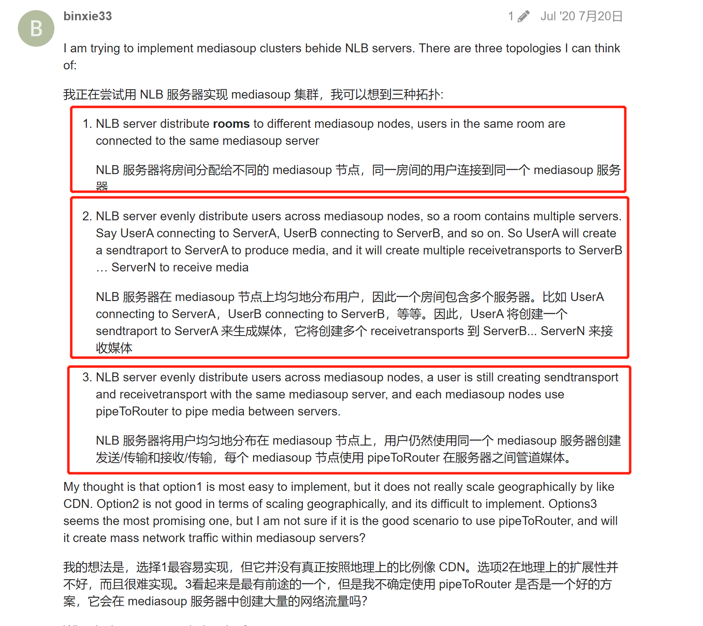

## 这是一个Mediasoup的集群项目

## 出发点
1. mediasoup没有提供集群方案，只是隐约说到PipTransport可以实现
2. mediasoup基于房间，提供了js接口。
3. mediasoup没有完整的native客户端demo，如pc的qt，Android的java，ios的oc。

## 目标
1. 实现mediasoup集群商用部署
2. 要根据地域，运营商，优先级进行集群调度，区域用户隔离。
3. 要做到【命名空间】隔离不同的用户群。
4. 要做集群的可视化监控管理
5. 转发到传统直播如RTMP服务器做大规模直播。
6. 转发到存储服务器做存储。
7. 媒体和信令分离
8. 支持不同的部署模式：全球/全国/区域/私网/单机。

## 方案对比
集群可以基于一下三个基础来做：
1. 基于房间：
    - 同一个房间调度到同一个服务器。 
    - 全局对等节点。
    - 优劣：简单，信令和媒体都可以不改动；跨国有问题，无法做地域隔离和就近接入。
2. 基于用户：
    - 同一个用户调度到同一个服务器。 
    - 客户端只有收发两个transport，worker内部用pipeToRouter转发。
    - 优劣：全局管理room和服务端转发都比较复杂。
3. 基于音视频流：
    - 同一个流掉才调度同一个服务器。
    - 用户需要创建很多个transport连接很多服务器。
    - 优劣：连接太多可能带来网络不稳定性，客户端复杂。
    
[参考连接](https://mediasoup.discourse.group/t/recommended-mediasoup-cluster-topology/1497)
    
    
## 方案选择与计划
1. 第一步(V1.0)：基于房间的集群，共四个模块，用户从调度中心获取节点后连接。
    - 通讯节点：mediasoup-demo程序，可以不断扩展。
    - 数据同步：redis/rabitmq。
    - 调度中心：
        - 保证同一个room的用户分配到一个服务器。
        - 同时做负载均衡
        - 新建房间时调度到用户所在区域。
    - 集群可视化管理web
   
2. 第二步(V2.0)：基于用户或者流
    - woker的接口从js改成c++
    - 信令和媒体分离
    - 单端口
## 开发过程：
1. V1.0开发
    - 部署多个demo。
    - 调度开发：加入一个信令重定向命令：无差别的对待调度中心和通讯节点，同时兼容单机部署和集群。
    - 在demo加入redis共享room数据和监控数据。
    - 开发集群可视化管理模块。
    

